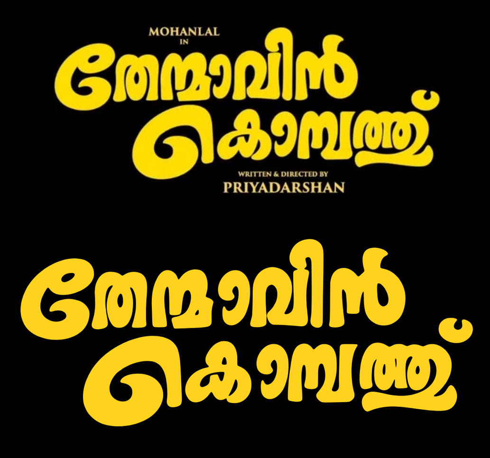
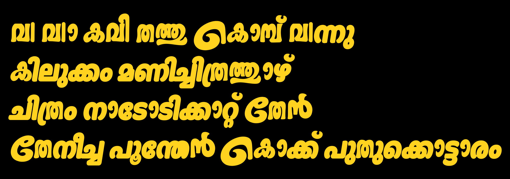
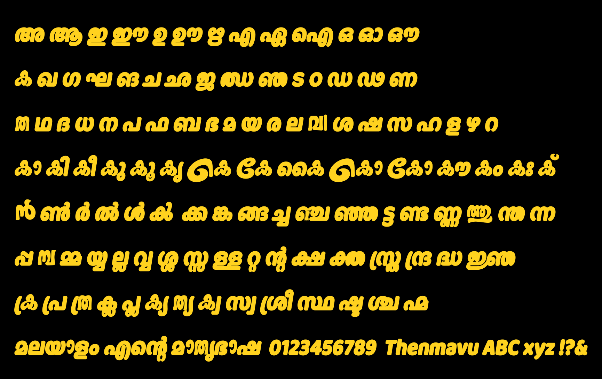
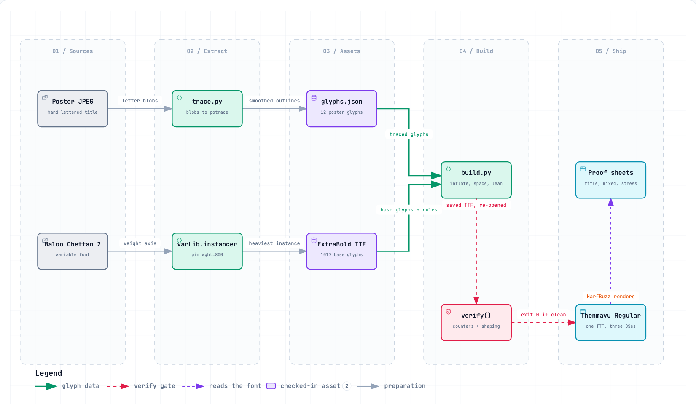
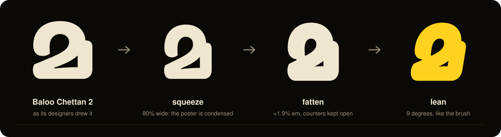

<p align="center">
  
</p>

<h1 align="center">🥭 Thenmavu</h1>

<p align="center">
  <b>A fat, leaning Malayalam display font, traced from a hand-lettered film title.</b><br>
  Type <code>തേന്മാവിൻ കൊമ്പത്ത്</code> and get the poster's own curls. Type anything else and get a face built to sit beside them.
</p>

<p align="center">
  
  
  
  
  
  
</p>

---

## 📥 Install

The font is one file: **[`dist/Thenmavu-Regular.ttf`](dist/Thenmavu-Regular.ttf)** (365 KB). It works on all three systems.

| System | How |
|---|---|
| 🍎 **macOS** | Double-click the `.ttf` → **Install** in Font Book. Or: `cp dist/Thenmavu-Regular.ttf ~/Library/Fonts/` |
| 🪟 **Windows** | Right-click the `.ttf` → **Install** (or **Install for all users**) |
| 🐧 **Linux** | `mkdir -p ~/.local/share/fonts && cp dist/Thenmavu-Regular.ttf ~/.local/share/fonts/ && fc-cache -f` |

Restart the app you want it in; it appears as **Thenmavu**. Replacing an older copy? See
[Troubleshooting](docs/TROUBLESHOOTING.md#-the-app-still-shows-the-old-version) — font caches are sticky.

> [!TIP]
> This is a **display** face. Use it large — titles, posters, thumbnails, reel captions. Its counters
> are pinholes by design, and at text sizes they fill in.

## 🖼️ What it looks like

**The title, typed as live text, under the poster it came from**



**Traced and untraced letters in the same words**



**The whole script** — vowel signs, chillus, conjuncts, Latin, digits



## ✨ What is in it

| | |
|---|---|
| ✍️ **12 traced glyphs** | The poster's own lettering: `േ ത ന്മ ാ വ ൻ െ ക മ്പ ത്ത ്` and the fused `വി`. They appear in every word that uses those letters. |
| 🅱️ **~1000 reshaped glyphs** | [Baloo Chettan 2](https://github.com/EkType/Baloo2) ExtraBold — squeezed to 80% width, fattened until the strokes match, leaned 9° like the brush. |
| 🌀 **Flourishes that know their place** | The oversized `െ` and `േ` open a word (`തേൻ`, `കൊമ്പ്`). Inside one (`നാടോടി`, `പൂന്തേൻ`) they switch to a normal-height form. |
| 📏 **Optical spacing** | Malayalam letters are spaced from the edge where they actually face each other, not from their bounding box. |
| 🛡️ **A build that refuses to lie** | It re-opens the saved font and fails if a counter closed up or if HarfBuzz shapes the proof text unlike the base font. |

No open-licence Malayalam font has this poster's hand — thirteen were compared — so the untraced
letters are a close relative of it, not the same drawing. They are heavier, narrower and more
regular than the twelve.

<details>
<summary><b>🔤 Things to know when setting type</b></summary>

- The big `െ` drops well below the baseline. Give multi-line text generous line spacing.
- The poster indents its second line so the `്` clears the `ൻ` above. Do the same when you stack the two lines tightly.
- `വ` + `ി` always fuse into the poster's single shape. Every other consonant uses Baloo's `ി`.
- The word-start rule is a `calt` (contextual alternates) feature — on by default almost everywhere. With it switched off, the big form shows in every position.

</details>

## ⚙️ How it is made

<picture>
  <source media="(prefers-color-scheme: dark)" srcset="docs/diagrams/build-pipeline-dark.png">
  
</picture>

<sub>Interactive version (pan, zoom, trace a path): <a href="docs/diagrams/build-pipeline.html"><code>docs/diagrams/build-pipeline.html</code></a> — download and open it; GitHub does not render HTML.</sub>

One base glyph through the build:



➡️ The full walk-through is in **[docs/ARCHITECTURE.md](docs/ARCHITECTURE.md)**.

## 🧰 Built with

| | Tool | Job here |
|---|---|---|
| 🐍 | **Python 3.13** + [uv](https://docs.astral.sh/uv/) | everything; one pinned virtualenv |
| 🔤 | [**fontTools**](https://github.com/fonttools/fonttools) 4.65.0 | reads and writes the font, its glyphs and its OpenType rule tables |
| ✂️ | [**skia-pathops**](https://github.com/fonttools/skia-pathops) 0.9.2 | Skia's boolean geometry: fatten, soften, keep counters open |
| 🔡 | [**HarfBuzz**](https://harfbuzz.github.io/) via `uharfbuzz` 0.56.1 | shapes Malayalam text — for the proofs and for the build's self-check |
| ✒️ | [**potrace**](https://potrace.sourceforge.net/) 1.16 | turns the poster's pixels into smooth curves |
| 🖼️ | [**Pillow**](https://python-pillow.github.io/) 12.3.0 | isolates each letter on the poster; assembles proof sheets |
| 🧭 | [**Archify**](https://github.com/tt-a1i/archify) | the pipeline diagram above |

➡️ What each one does and why it was chosen: **[docs/TECHNOLOGY.md](docs/TECHNOLOGY.md)**.

## 🔁 Rebuild it

```sh
uv venv --python 3.13 .venv
uv pip install --python .venv/bin/python -r requirements.txt

.venv/bin/python trace.py            # 🖼️  poster → traced/glyphs.json   (needs potrace; output is checked in)
.venv/bin/python build.py            # 🏗️  → dist/Thenmavu-Regular.ttf + dist/OFL.txt, then verifies it
.venv/bin/python proof.py dist/Thenmavu-Regular.ttf proofs/reference-poster.jpeg   # 📄 needs hb-view
.venv/bin/python tools/make_svgs.py  # 🎞️  the animated SVGs on this page
```

`build.py` alone is enough for most changes. Every knob — weight, squeeze, lean, spacing — and what
was measured when setting it is in **[docs/TUNING.md](docs/TUNING.md)**.

## 🗂️ Layout

```text
thenmavu-font/
├── dist/            📦 the font to install, and its licence
├── base/            🅱️ Baloo Chettan 2: the variable font, the pinned ExtraBold, its OFL
├── traced/          ✍️ glyphs.json — the poster's letterforms as outlines
├── proofs/          🖼️ title-card crop + rendered proof sheets (its README explains the crop)
├── trace.py         poster → outlines
├── build.py         base + outlines → font, then verify()
├── proof.py         font → proof sheets
├── tools/           🎞️ make_svgs.py
└── docs/            📚 architecture, technology, tuning, troubleshooting, diagrams, assets
```

## 📚 Docs

| | |
|---|---|
| 🏛️ [Architecture](docs/ARCHITECTURE.md) | the pipeline, stage by stage, and what `verify()` guarantees |
| 🧰 [Technology](docs/TECHNOLOGY.md) | every tool and OpenType feature used, and why |
| 🎛️ [Tuning](docs/TUNING.md) | the build's flags, the measurements behind the defaults, re-tracing from a better poster |
| 🩹 [Troubleshooting](docs/TROUBLESHOOTING.md) | stale caches, big flourishes mid-word, build errors, uninstalling |
| 📝 [Changelog](CHANGELOG.md) | what changed in each version, and why |
| 🗺️ [Roadmap](docs/ROADMAP.md) | what would make it better |
| 🤝 [Contributing](CONTRIBUTING.md) | the change loop: build, look, log |

## ⚖️ Licence and use

- 🔤 **The font software** is under the [SIL Open Font License 1.1](dist/OFL.txt). Keep that file with the
  font if you pass it on. Baloo Chettan 2 is © The Baloo 2 Project Authors; the OFL asks modified
  versions to carry a different name, hence "Thenmavu".
- ✍️ **The twelve traced letters** are part of that font software. They were traced from the film's title
  lettering, and letterforms are not copyright subject matter in the United States or in India, so they
  ship under the OFL like everything else. A request, not a term: keep them to personal, fan and
  non-commercial titling. `build.py --traced ''` builds a version containing only the OFL-derived letters.
- 🖼️ **`proofs/reference-poster.jpeg`** is the film's title card, reproduced only to show what was traced;
  [proofs/README.md](proofs/README.md) says why that is fair use and fair dealing.
- 🐍 **The build scripts** are under the [MIT License](LICENSE-CODE.txt).

[LICENSE.md](LICENSE.md) spells out all four cases. This is a tribute: the film, its title and its artwork
belong to their rights holders, and this project is not affiliated with or endorsed by them.
