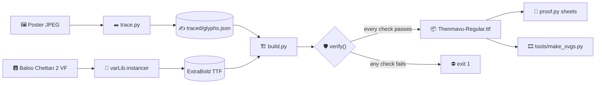

# 🏛️ Architecture

How a film poster and an open-source font become one installable `.ttf`.

<picture>
  <source media="(prefers-color-scheme: dark)" srcset="diagrams/build-pipeline-dark.png">
  
</picture>

🧭 Made with Archify from <a href="diagrams/build-pipeline.dataflow.json"><code>build-pipeline.dataflow.json</code></a>.
The interactive version is <a href="diagrams/build-pipeline.html"><code>build-pipeline.html</code></a> — download and open it.

## 🗺️ The same pipeline, as text

## 1. 🖼️ `trace.py` — poster → outlines

The poster's letters are only about 100 px tall, in a JPEG. Four things make that traceable:

| Step | Why |
|---|---|
| **Flood-fill each yellow blob** | The artist left a hairline of black between letters, so each glyph is one connected blob. Twelve blobs, twelve glyphs. |
| **Read the edge from luminance** | JPEG stores colour at half resolution. Finding the ink by its blue channel traced jagged; brightness is stored at full resolution. |
| **Mask background near other blobs** | A neighbour 5 px away has an anti-aliased halo that otherwise leaks into this glyph as a sliver. |
| **Upscale 8×, blur 1.1 px, potrace** | The blur removes the pixel staircase and still keeps the 5 px pinhole counters open. `alphamax 1.334` means no corners at all — this lettering has none. |

`വി` needs one extra step. The artist fused `വ` and `ി` into a single shape, but a font stores them
separately. So the blob is traced twice: once whole (it becomes a **ligature**), and once with the
ascender cut off and capped with a disc (it becomes a standalone `വ`).

Output: `traced/glyphs.json` — SVG path data in font units, one poster pixel = 6 units. It is checked
in, so rebuilding the font does not need potrace or the poster.

## 2. 🏗️ `build.py` — base + outlines → font

For each of Baloo's 1017 glyphs:

1. **Squeeze** to 80% width (94% height). The poster's letters are condensed. GPOS distances are
   scaled with the outlines so kerning and mark offsets still fit.
2. **Inflate.** Fill the silhouette solid, dilate it with round joins, then close it slightly so
   crotches go soft. Squeezing thinned the vertical stems; growth puts the weight back evenly, which
   also flattens Baloo's thick/thin contrast — right for brush lettering.
3. **Keep counters.** A counter's *region* is the hole minus anything sitting inside it. It shrinks
   by the full growth only if a pinhole still fits, otherwise by as much as leaves one. Apertures
   that bridge into a hole too small to read are filled.
4. **Space by the facing edge.** Side bearings are measured where neighbouring letters actually face
   each other (0.15–0.45 em above the baseline), not at the bounding box. See
   [Tuning](TUNING.md#-spacing-what-was-measured).
5. **Lean** 9°: `x += y · tan 9°`.

Then the twelve traced outlines replace their Baloo glyphs (positioned with the lean *taken out*, so
their side bearings mean the same thing as everyone else's), and two rules are added:

| Rule | Feature | What it does |
|---|---|---|
| `വ` + `ി` → fused shape | `psts` | a ligature, appended so it runs after Baloo's own substitutions |
| `[letter] െ'` → plain `െ` | `calt` | inside a word, the oversized flourish becomes Baloo's normal-height form |

> 💡 **Why `calt`, not `psts`?** HarfBuzz applies `psts` one syllable at a time. "Is there a letter
> before me?" has to look across a syllable boundary, and only run-wide features like `calt` can.
> And OpenType cannot say "at the start of a word" at all — only "after a letter" — so the flourish
> is the default glyph and the rule *removes* it.

## 3. 🛡️ `verify()` — check the file on disk

The build re-opens the font it just saved. It exits non-zero if:

- 🔴 any base counter closed up (each original counter must still contain open space);
- 🔴 the character map changed, or the glyph order is not "the base's, plus the new glyphs";
- 🔴 HarfBuzz shapes any proof line into a glyph sequence other than *the base font's sequence with
  the two new rules applied* — checked twice, untagged and tagged as Malayalam (`ml`), because
  renderers that tag the text select a different language system;
- 🔴 the proof text never shows each flourish both opening a word and inside one — otherwise the
  check above would prove nothing about the `calt` rule.

An invariant written in a comment is not enforced. This one runs on every build.

## 4. 📄 `proof.py` and 🎞️ `tools/make_svgs.py`

`proof.py` renders three sheets through `hb-view`, so what you see is real shaping, not a mock-up.
`make_svgs.py` draws the README's animated SVGs from the font's own outlines: GitHub shows SVGs
through ``, which allows CSS animation but no scripts and no external fonts.

## 🧱 Why derive instead of draw?

A Malayalam font is mostly a **shaping program**. `ന + ് + മ` becomes one ligature through GSUB
rules; `േ` is moved in front of its consonant by the shaping engine before the font is even
consulted. Baloo's rule tables encode years of that work. Reshaping outlines and keeping the rules is
what makes the result type correctly in every app — which is where hand-traced fonts usually break.
